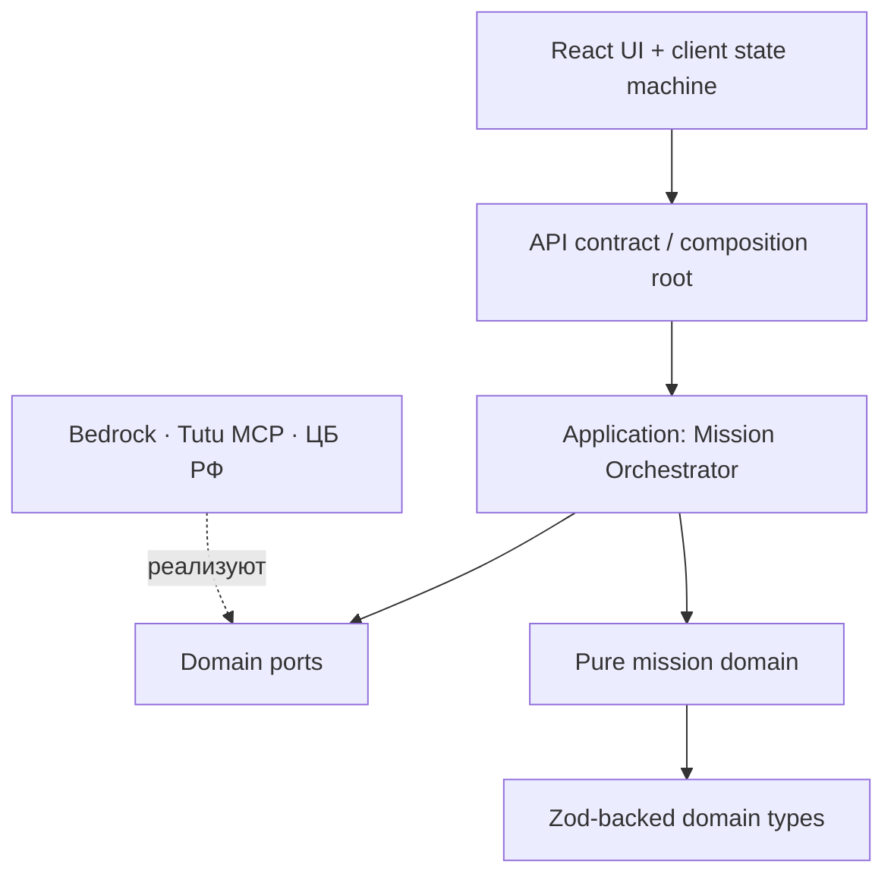
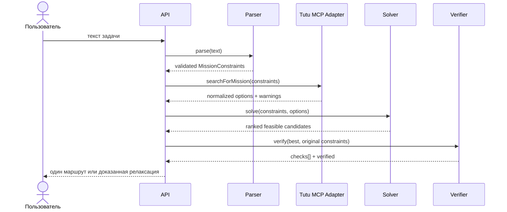
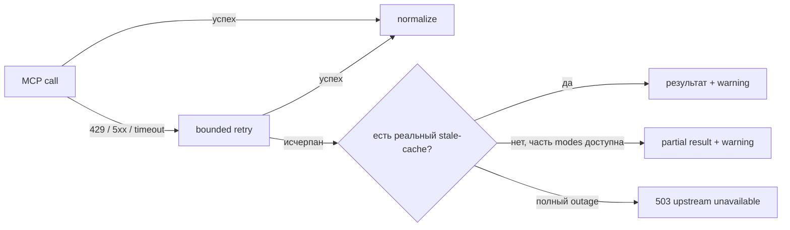

# Архитектура tutu mission

## Цели

Архитектура оптимизирована под три свойства: доверие к результату, устойчивость внешних интеграций и возможность объяснить каждое решение жюри. LLM не является источником истины для цены, времени или статуса маршрута.

## Слои и направление зависимостей

Правило: доменный слой не знает о HTTP, React, AWS, Tutu MCP или ЦБ РФ. Это ограничение автоматически проверяется `src/lib/architecture.test.ts`.

## Компоненты

| Компонент | Ответственность | Побочные эффекты |
|---|---|---|
| Mission Parser | Извлекает строгие ограничения, требует уточнение вместо догадки | вызов Bedrock либо локальный fallback |
| Tutu MCP Client | JSON-RPC, retry, timeout, cache, coalescing | сеть |
| Tutu Provider | Anti-corruption layer: нормализует транспорт и отели | вызывает MCP client |
| Candidate Generator | Собирает хронологически возможные комбинации | нет |
| Solver | Применяет hard constraints | нет |
| Ranker | Вычисляет воспроизводимый score | нет |
| Verifier | Независимо проверяет выбранного кандидата | нет |
| Relaxation Engine | Ищет минимальное доказанное изменение | нет |
| Orchestrator | Управляет сценарием solve/adjust и trace | зависит только от портов |

## Контракт решения

`verified` вычисляется как конъюнкция программных checks. Текст объяснения не участвует в принятии решения.

## Инварианты

1. Цена кандидата равна сумме всех сегментов и проживания.
2. Прибытие происходит до `eventAt - arrivalBufferMin`.
3. Возврат не может начаться до завершения outbound и проживания.
4. Запрещённый вид транспорта не встречается ни в одном сегменте.
5. Технический отказ провайдера не классифицируется как невозможная поездка.
6. Relaxation показывается только вместе с кандидатом, прошедшим verifier после изменения.
7. Сырые MCP responses не покидают adapter layer.

## Отказоустойчивость

Настройки retry, timeout, pagination, concurrency и cache ограничены безопасными runtime bounds в `src/lib/runtime-config.ts`.

## Масштабирование

Новый транспортный провайдер реализует `MissionSearchProvider`; solver и verifier не меняются. Новый parser реализует `MissionParser`. Новое ограничение добавляется в schema, solver check, verifier check и соответствующие тесты — без изменения инфраструктурных адаптеров.

## Quality gate

Pull request принимается только после TypeScript strict typecheck, ESLint, unit/contract/architecture tests и Next.js production build. Тот же набор запускается локально командой `npm run check` и в GitHub Actions.
